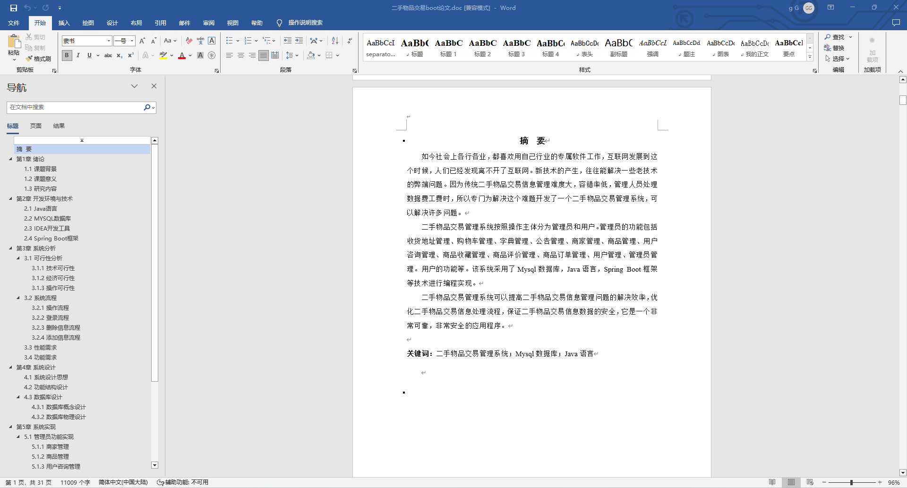
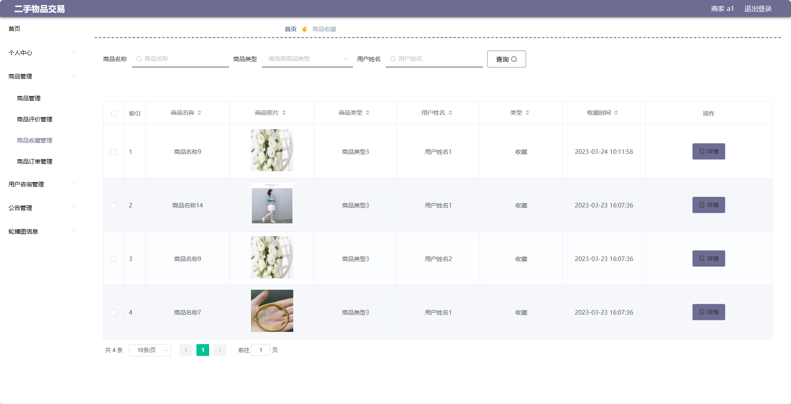

基于SpringBoot的二手物品交易平台（程序+论文）
=
- 完整代码获取地址：从戎源码网 ([https://armycodes.com/](https://armycodes.com/))
- 作者微信：19941326836  QQ：952045282 
- 承接计算机毕业设计、Java毕业设计、Python毕业设计、深度学习、机器学习
- 选题+开题报告+任务书+程序定制+安装调试+论文+答辩ppt 一条龙服务
- 所有选题地址https://github.com/nature924/allProject

一、项目介绍
---
基于Spring Boot框架实现的二手物品交易平台，系统包含三种角色：管理员、商家、用户,系统分为前台和后台两大模块，主要功能如下。
### 前台：
1. 首页：展示平台的概况、推荐商品等信息。
2. 公告：发布平台的公告通知。
3. 商家：展示注册的商家信息。
4. 商品：展示所有在售的二手商品。
5. 个人中心：用户可以管理个人信息。
6. 购物车：用户可以将感兴趣的商品加入购物车。

### 后台：
### 商家：
1. 个人中心：商家可以管理个人信息，包括修改密码、查看个人资料等。
2. 商品管理：商家可以新增、编辑、删除自己发布的商品。
3. 用户咨询管理：商家可以查看用户对商品的咨询留言，并进行回复。
4. 公告管理：商家可以发布平台公告，通知用户关于店铺活动、促销等消息。
5. 轮播图信息：商家可以设置首页轮播图的图片及链接。

### 管理员：
1. 个人中心：管理员可以管理个人信息，包括修改密码、查看个人资料等。
2. 管理员管理：管理员可以对其他管理员进行添加、编辑、删除等操作。
3. 商家管理：管理员可以审核商家的注册申请，并对商家进行禁用或删除操作。
4. 用户管理：管理员可以查看用户列表，对用户进行禁用、删除等操作。
5. 商品管理：管理员可以对所有商品进行管理，包括编辑、删除等操作。
6. 用户咨询管理：管理员可以查看用户对商品的咨询留言，并进行回复和删除操作。
7. 公告管理：管理员可以发布平台公告，通知用户关于平台更新、活动等信息。
8. 基础数据管理：管理员可以管理系统的基础数据
9. 轮播图信息：管理员可以设置首页轮播图的图片及链接

二、项目技术
---
- 编程语言：Java
- 数据库：MySQL
- 项目管理工具：Maven
- 前端技术：VUE、HTML、Jquery、Bootstrap
- 后端技术：Spring、SpringMVC、MyBatis

三、运行环境
---
- 操作系统：Windows、macOS都可以
- JDK版本：JDK1.8以上都可以
- 开发工具：IDEA、Ecplise、Myecplise都可以
- 数据库: MySQL5.7以上都可以
- Tomcat：任意版本都可以
- Maven：任意版本都可以

四、运行截图
---
### 论文截图：

### 程序截图：

